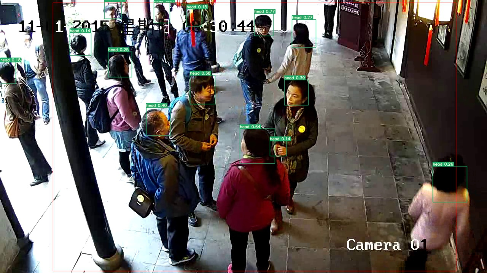

# Pedestrian detection in scenic spots by using onnxruntime
Use pytorch1.5 to train yolov5 and export the onnx model. Use onnxruntime to run the onnx model on the cpu.
yolov5 refers to https://github.com/ultralytics/yolov5
* Face detection model: yolov5 
* requirement:
    * opencv-python
    * numpy
    * onnxruntime-1.5.2 (cpu)

* onnx model: download from  https://drive.google.com/file/d/1jCT7-dpeHhCJ0DBrx4e1Vap9EFaguZs3/view?usp=sharing
* run:
``` shell script
    python onnx_infer.py --onnx_path=./best.onnx --data_dir=./input
```
* result
    